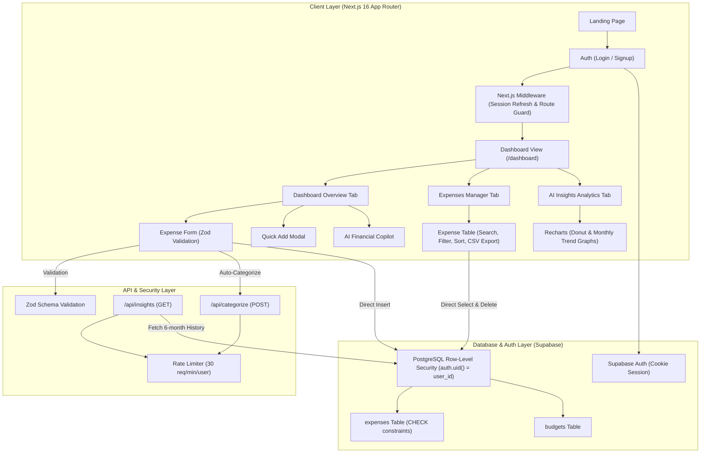

# FinanceAI

**AI-assisted personal finance platform with intelligent expense categorization, financial analytics, and Supabase Row-Level Security.**

---

## 🏗️ Architecture & System Design



---

## 🔒 Supabase Row-Level Security (RLS) & Database Schema

The platform enforces zero-trust data access. Client requests interface directly with PostgreSQL via `@supabase/ssr` with cookie sessions. **Row-Level Security (RLS)** policies strictly ensure users can only query or mutate rows where `auth.uid() = user_id`.

### `public.expenses` Table Schema & Constraints

```sql
CREATE TABLE IF NOT EXISTS public.expenses (
  id UUID DEFAULT gen_random_uuid() PRIMARY KEY,
  user_id UUID NOT NULL REFERENCES auth.users(id) ON DELETE CASCADE,
  amount DECIMAL(12,2) NOT NULL CHECK (amount > 0 AND amount <= 100000000),
  description VARCHAR(500) NOT NULL,
  category TEXT NOT NULL CHECK (
    category IN (
      'Food & Dining', 'Groceries', 'Transportation', 'Shopping',
      'Entertainment', 'Bills & Utilities', 'Health & Medical',
      'Education', 'Travel', 'Subscriptions', 'Housing & Rent',
      'Personal Care', 'Gifts & Donations', 'Income', 'Other'
    )
  ),
  ai_category TEXT,
  expense_date DATE NOT NULL DEFAULT CURRENT_DATE,
  created_at TIMESTAMPTZ DEFAULT now()
);

-- Enable RLS
ALTER TABLE public.expenses ENABLE ROW LEVEL SECURITY;

-- Strict RLS Policies (auth.uid() = user_id)
CREATE POLICY "Users can view own expenses"
  ON public.expenses FOR SELECT USING (auth.uid() = user_id);

CREATE POLICY "Users can insert own expenses"
  ON public.expenses FOR INSERT WITH CHECK (auth.uid() = user_id);

CREATE POLICY "Users can update own expenses"
  ON public.expenses FOR UPDATE USING (auth.uid() = user_id) WITH CHECK (auth.uid() = user_id);

CREATE POLICY "Users can delete own expenses"
  ON public.expenses FOR DELETE USING (auth.uid() = user_id);

CREATE INDEX idx_expenses_user_date ON public.expenses(user_id, expense_date DESC);
```

---

## 🛡️ Security & Input Validation Architecture

1. **Zod Input Schema Validation** (`src/lib/validation.ts`):
   - Validates all expense inputs (`amount > 0`, `description.length <= 500`, enum category checks).
   - Validates API request bodies before execution.
2. **API Rate Limiting** (`src/lib/rate-limit.ts`):
   - Sliding-window rate limiter enforcing max 30 requests per minute per user on API endpoints (`/api/categorize`, `/api/insights`), returning `429 Too Many Requests`.
3. **HTTP Security Headers** (`next.config.ts`):
   - Enforces `X-Content-Type-Options: nosniff`, `X-Frame-Options: DENY`, `X-XSS-Protection`, `Referrer-Policy`, and `Strict-Transport-Security`.
4. **CSV Formula Injection Prevention**:
   - Sanitizes exported CSV data starting with `=`, `+`, `-`, or `@` to prevent spreadsheet code execution.
5. **Information Leakage Defense**:
   - Obfuscates raw database error tracebacks into generic client responses (`500 Internal Server Error`).

---

## ⚡ API Endpoint Documentation

### 1. `POST /api/categorize`
Categorizes an expense description into one of 15 standard categories.
- **Authentication**: Required (`supabase.auth.getUser()`)
- **Rate Limit**: 30 requests / min
- **Request Body**:
  ```json
  { "description": "Coffee at Starbucks" }
  ```
- **Response (200 OK)**:
  ```json
  { "category": "Food & Dining" }
  ```

### 2. `GET /api/insights`
Calculates 6-month category breakdown, monthly trends, and AI recommendations.
- **Authentication**: Required (`supabase.auth.getUser()`)
- **Rate Limit**: 30 requests / min
- **Response (200 OK)**:
  ```json
  {
    "categoryBreakdown": [{ "category": "Food & Dining", "amount": 1500, "percentage": 30.0 }],
    "monthlyTrends": [{ "month": "Sep 2026", "amount": 5000 }],
    "insights": [{ "type": "info", "title": "Top Spending Category", "message": "..." }],
    "totalSpent": 5000,
    "transactionCount": 3,
    "topCategory": "Food & Dining",
    "averageTransaction": 1666.67
  }
  ```

---

## 🧪 Testing

The codebase includes automated unit test suites using **Vitest**:

```bash
# Run test suite
npm test
```

### Test Coverage:
- `src/__tests__/categorizer.test.ts` — Categorization keywords & insights generation.
- `src/__tests__/validation.test.ts` — Zod schema validation checks.
- `src/__tests__/rate-limit.test.ts` — Sliding window rate limit logic.

---

## 🛠️ Getting Started

### 1. Clone Repository
```bash
git clone https://github.com/rajputranjan7/ai-finance-tracker.git
cd ai-finance-tracker
```

### 2. Install Dependencies
```bash
npm install
```

### 3. Configure Environment Variables
Create `.env.local`:
```env
NEXT_PUBLIC_SUPABASE_URL=https://gkgdndgbvpiconmvwwou.supabase.co
NEXT_PUBLIC_SUPABASE_ANON_KEY=your_supabase_anon_key
```

### 4. Run Development Server & Build
```bash
# Start local dev server
npm run dev

# Run production build check
npm run build
```

---

## 📄 License

MIT License. Created for AI-assisted personal finance tracking.
